# PRD - PRODUCT REQUIREMENTS DOCUMENT

> **Product:** TeleHealth Australia  
> **Version:** 1.0  
> **Created:** 2026-02-21  
> **Author:** BA Team  
> **Status:** Draft

---

## TABLE OF CONTENTS

1. [Product Vision](#1-product-vision)
2. [User Personas](#2-user-personas)
3. [User Flows](#3-user-flows)
4. [Feature List](#4-feature-list)
5. [Scope](#5-scope)
6. [Assumptions](#6-assumptions)
7. [Constraints](#7-constraints)

---

## 1. PRODUCT VISION

### 1.1 Vision Statement

> *"Provide convenient, fast, and reliable online healthcare services for Australians, enabling them to access AHPRA-certified doctors anytime, anywhere - with quality equivalent to in-person consultations."*

### 1.2 Problem Statement

| Problem | Description |
|---------|-------------|
| **Difficult GP Access** | Long waiting times, hard to book appointments with GPs |
| **Inconvenience** | Need to travel to clinics, wait in waiting rooms |
| **Limited Hours** | Clinics only open during business hours |
| **Remote Areas** | Rural/remote residents have limited healthcare access (45+ min from GP) |
| **Cost** | Travel costs, time off work for appointments |

### 1.3 Goals & Success Metrics

| ID | Goal | Metric | Target | Benchmark |
|----|------|--------|--------|-----------|
| **G01** | Increase accessibility | Consultations/month | 10,000+ after 6 months | Updoc: 1M+ users |
| **G02** | Reduce wait time | Time from request to consult | < 60 min (standard), < 15 min (priority) | Instant Consult: < 15 min |
| **G03** | Ensure quality | Patient rating | ≥ 4.5/5 | Qoctor: 4.6/5 Trustpilot |
| **G04** | Expand coverage | Postcodes served | 95% Australian postcodes | Updoc: 95% suburbs |
| **G05** | Increase retention | Return usage rate | ≥ 40% | - |
| **G06** | Competitive pricing | Service price | Medical Cert from $19.99 | Qoctor: $14.99, Our Sage: $21 |

---

## 2. USER PERSONAS

### 2.1 Persona 1: Patient - Sarah (Busy Office Worker)

| Attribute | Value |
|-----------|-------|
| **Age** | 32 |
| **Occupation** | Marketing Manager |
| **Location** | Sydney CBD |
| **Income** | $85,000/year |
| **Devices** | iPhone 14, MacBook |

**Pain Points:**
- No time to visit clinics in person
- Long waiting times at clinics
- Difficult to book GP appointments
- Need healthcare services outside business hours

**Goals:**
- Receive quick, convenient healthcare
- Save travel time
- Access services 24/7 from anywhere

**Scenarios:**
| ID | Scenario | Service | Frequency |
|----|----------|---------|-----------|
| S01 | Need sick leave certificate for work | Medical Certificate | 2-3 times/year |
| S02 | Refill contraceptive prescription | Repeat Prescription | Every 3 months |
| S03 | Consult for flu symptoms | Telehealth Consultation | 1-2 times/year |

---

### 2.2 Persona 2: Patient - Mike (Regional Senior)

| Attribute | Value |
|-----------|-------|
| **Age** | 68 |
| **Occupation** | Retired |
| **Location** | Wagga Wagga, NSW (regional) |
| **Income** | Pension |
| **Devices** | Samsung Galaxy, iPad |

**Pain Points:**
- Must drive far to see GP just for repeat prescriptions
- Local GP often fully booked, 1-2 week wait
- Difficult to travel in bad weather or poor health

**Goals:**
- Refill regular medications without traveling
- Have doctor consultation when needed
- Easy to use, not too complex

**Scenarios:**
| ID | Scenario | Service | Frequency |
|----|----------|---------|-----------|
| S04 | Refill diabetes medication (Metformin) | Repeat Prescription | Monthly |
| S05 | Refill blood pressure medication | Repeat Prescription | Monthly |
| S06 | Consult for unusual symptoms | Telehealth Consultation | 2-3 times/year |
| S07 | Request regular HbA1c test | Pathology Request | Every 3 months |

---

### 2.3 Persona 3: Partner Doctor - Dr. James

| Attribute | Value |
|-----------|-------|
| **Age** | 45 |
| **Specialty** | General Practitioner |
| **Experience** | 18 years |
| **AHPRA Status** | Active, General Registration |
| **Location** | Brisbane |
| **Platform** | Doctor Portal (Web) |

**Requirements:**
- Valid AHPRA registration
- Medical indemnity insurance

**Role:**
- Review consultation requests from patients
- Conduct consultations via chat/video/voice
- Assess symptoms and provide diagnosis
- Issue eScripts, Medical Certificates, Referrals
- Record clinical notes

**Key Functions:**
| Function | Description |
|----------|-------------|
| Request Queue | View pending requests |
| Patient Review | View patient information and history |
| Consultation | Conduct video/voice call |
| Prescribing | Issue eScript |
| Certificate | Issue Medical Certificate |
| Referral | Issue specialist referral |
| Notes | Record clinical notes |

---

### 2.4 Persona 4: Admin/Support - Lisa

| Attribute | Value |
|-----------|-------|
| **Age** | 28 |
| **Role** | Support Team Lead |
| **Platform** | Admin Portal (Web) |

**Roles:**
| Role | Responsibilities |
|------|------------------|
| System Admin | System configuration, permissions |
| Doctor Admin | Doctor application review, pool management |
| Support Agent | Handle complaints, technical support |
| Finance Admin | Payment management, refunds |

---

### 2.5 Persona 5: Business/Employer

| Attribute | Value |
|-----------|-------|
| **Definition** | Third party needing to verify Medical Certificates |
| **Platform** | Verification Portal (Web) |

**Use Case:**
- Employee submits Medical Certificate for sick leave
- HR/Manager needs to verify certificate validity
- Schools need to verify student certificates

**Information displayed on verification:**
| Field | Description |
|-------|-------------|
| Status | Valid / Invalid / Expired |
| Issue Date | Date issued |
| Valid Period | Leave period (from - to) |
| Doctor Name | Issuing doctor (partially hidden) |
| Certificate Type | Sick Leave / Carer's Leave |

> **Note:** Detailed medical information not displayed (Privacy Act 1988)

---

### 2.6 Actor-Feature Matrix

| Feature Group | Feature | Patient | Doctor | Admin | Employer |
|---------------|---------|:-------:|:------:|:-----:|:--------:|
| **Authentication** | Registration (F001) | ✅ | ✅ | ✅ | ❌ |
| | Social Login (F001a-c) | ✅ | ❌ | ❌ | ❌ |
| | Profile Management (F003) | ✅ | ✅ | ✅ | ❌ |
| **Prescription** | New/Repeat Request (F004, F005) | ✅ | ❌ | ❌ | ❌ |
| | Medication Search (F004a) | ✅ | ✅ | ❌ | ❌ |
| | Drug Interaction Check (F004b) | ❌ | ✅ | ❌ | ❌ |
| | eScript Generation (F012) | ❌ | ✅ | ❌ | ❌ |
| **Certificate** | Request Certificate (F006) | ✅ | ❌ | ❌ | ❌ |
| | Generate Certificate (F013) | ❌ | ✅ | ❌ | ❌ |
| | Verify Certificate (F019) | ❌ | ❌ | ❌ | ✅ |
| **Consultation** | Questionnaire (F007) | ✅ | ❌ | ❌ | ❌ |
| | Virtual Waiting Room (F009) | ✅ | ❌ | ❌ | ❌ |
| | Video/Voice Call (F010, F011) | ✅ | ✅ | ❌ | ❌ |
| | In-app Chat (F025) | ✅ | ✅ | ❌ | ❌ |
| **Payment** | Payment Processing (F008) | ✅ | ❌ | ✅ | ❌ |
| | Subscription (F031) | ✅ | ❌ | ✅ | ❌ |
| **Notification** | Email/Push (F017, F018) | ✅ | ✅ | ✅ | ❌ |
| **History** | Consultation History (F023) | ✅ | ✅ | ✅ | ❌ |
| | Prescription History (F024) | ✅ | ✅ | ✅ | ❌ |
| **Doctor Portal** | Request Queue (F014) | ❌ | ✅ | ❌ | ❌ |
| | Clinical Notes (F015a) | ❌ | ✅ | ❌ | ❌ |
| **Admin** | User Management (F020) | ❌ | ❌ | ✅ | ❌ |
| | Doctor Verification (F028) | ❌ | ❌ | ✅ | ❌ |
| | Reports (F027) | ❌ | ❌ | ✅ | ❌ |

**Summary by Actor:**

| Actor | Features | Primary Role |
|-------|----------|--------------|
| **Patient** | 25 | Use services, payment, view history |
| **Doctor** | 15 | Consultation, prescribing, certificates |
| **Admin** | 18 | System administration, user management, finance |
| **Employer** | 1 | Certificate verification |

---

## 3. USER FLOWS

> **Note:** Flows updated with new features:
> - Social Login (Google) instead of OTP
> - Email + Push instead of SMS
> - Video/Voice via Google Meet (Phase 2)
> - In-app Chat is primary consultation method in MVP

---

### 3.1 Flow 1: Patient - Registration & Login (MVP)

> Features: F001, F001a, F003

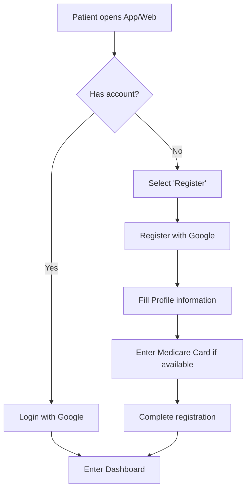

**Platform:** Web + iOS + Android  
**Features:** F001 (Registration), F001a (Google Login), F003 (Profile)

---

### 3.2 Flow 2: Patient - New Prescription Request (MVP)

> Features: F004, F004a, F007, F009, F025, F008, F012

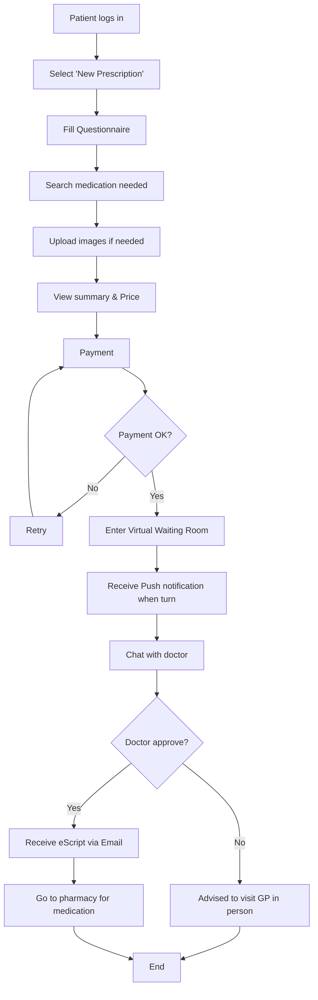

**Platform:** Web + iOS + Android  
**Output:** ePrescription (QR code) via Email

---

### 3.3 Flow 3: Patient - Repeat Prescription Request (MVP)

> Features: F005, F009, F025, F008, F012

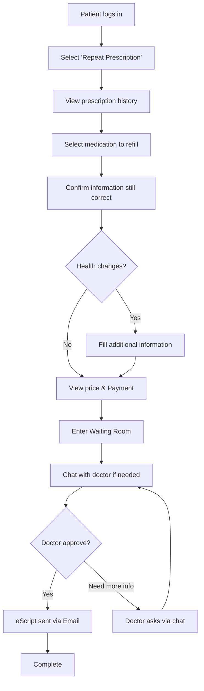

**Platform:** Web + iOS + Android

---

### 3.4 Flow 4: Patient - Medical Certificate Request (MVP)

> Features: F006, F007, F009, F025, F013, F008

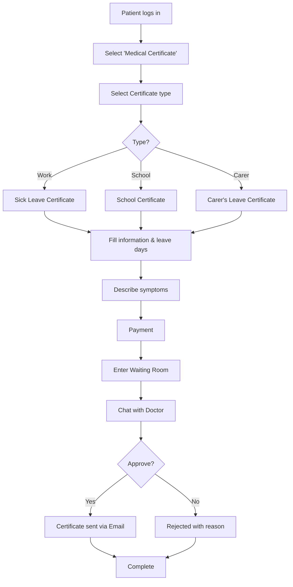

**Platform:** Web + iOS + Android  
**Output:** Medical Certificate PDF via Email  
**Verification:** Employer can verify online (F019)

---

### 3.5 Flow 5: Doctor - Processing Consultation (MVP)

> Features: F014, F014a, F014b, F015, F015a, F025, F012, F013

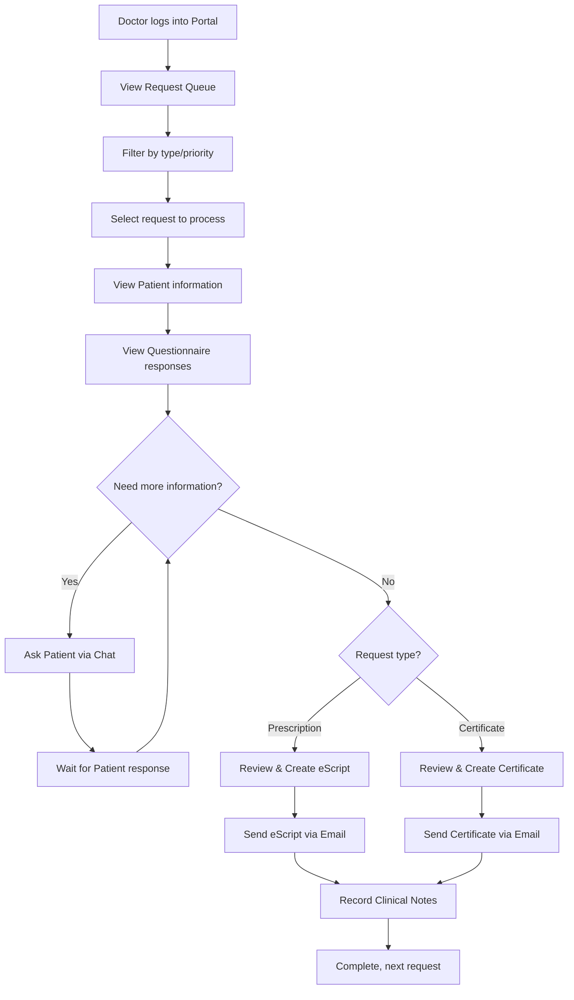

**Platform:** Doctor Portal (Web)

---

### 3.6 Flow 6: Employer - Verify Certificate (MVP)

> Features: F019

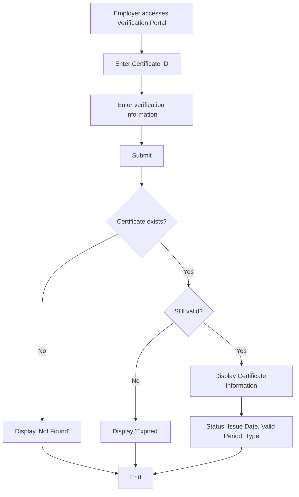

**Platform:** Web only  
**Privacy:** Detailed medical information not displayed (Privacy Act 1988)

---

### 3.7 Flow 7: Admin - Doctor Verification (MVP)

> Features: F028, F028b

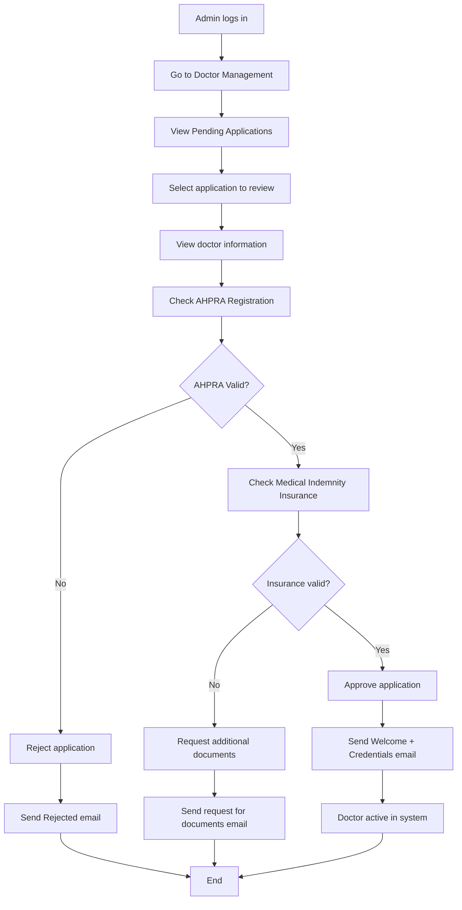

**Platform:** Admin Portal (Web)

---

### 3.8 Flow 8: Admin - User Management (MVP)

> Features: F020, F020a, F020b

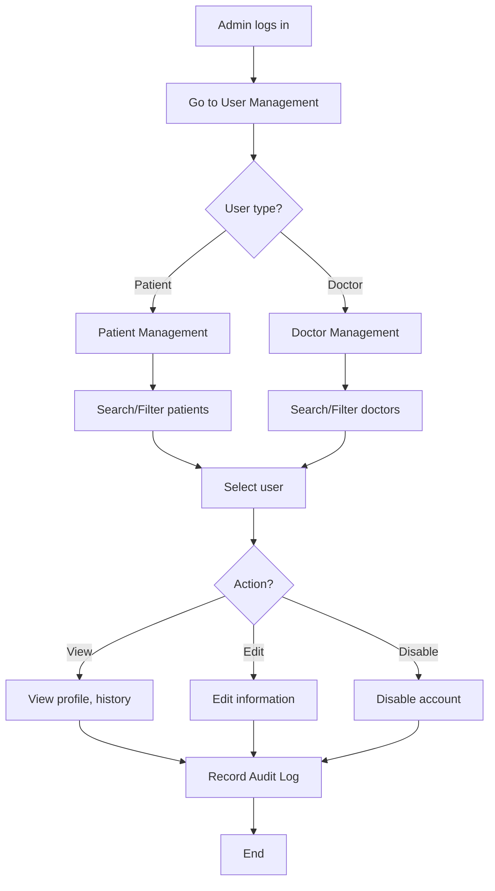

**Platform:** Admin Portal (Web)

---

### 3.9 Flow 9: Patient - View History (MVP)

> Features: F023, F024

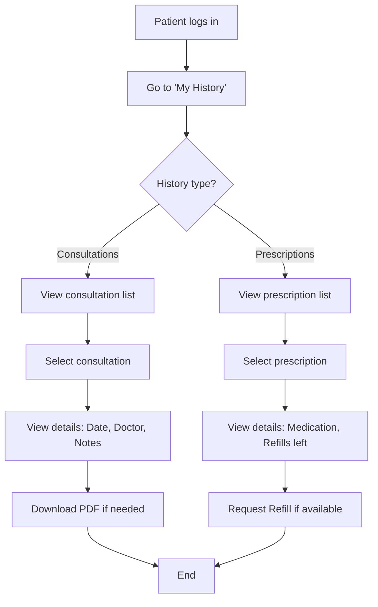

**Platform:** Web + iOS + Android

---

## PHASE 2 FLOWS (Should Have)

### 3.10 Flow 10: Patient - Specialist Referral (Phase 2)

> Features: F021

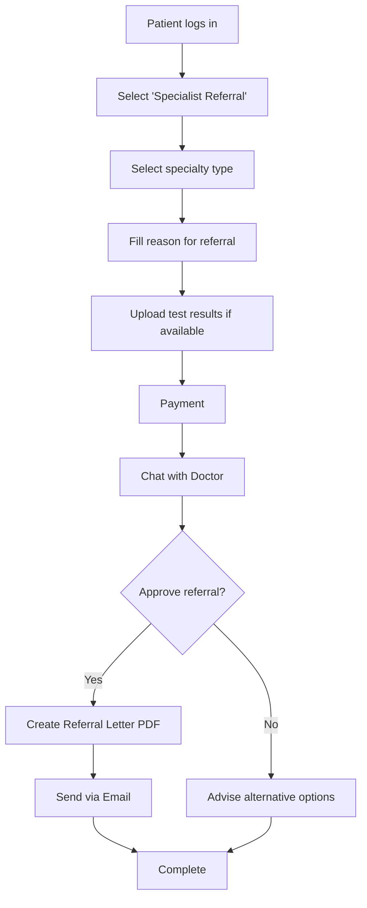

---

### 3.11 Flow 11: Patient - Pathology Request (Phase 2)

> Features: F022

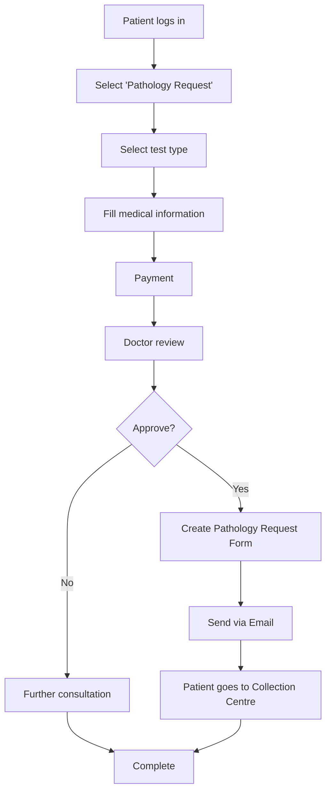

---

### 3.12 Flow 12: Support - Handle Ticket (Phase 2)

> Features: F048, F048a, F048b

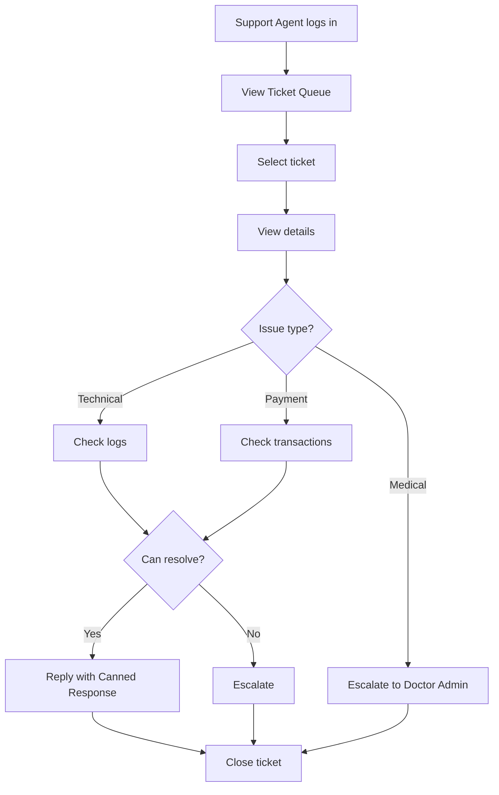

---

### 3.13 Flow 13: Admin - Refund Processing (Phase 2)

> Features: F029, F029a

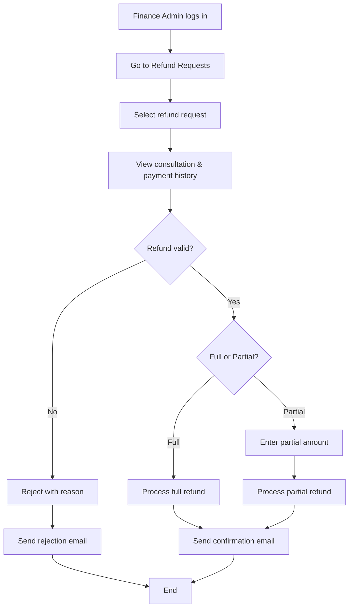

---

### 3.14 Flow 14: Admin - Reports & Analytics (Phase 2)

> Features: F027, F029b

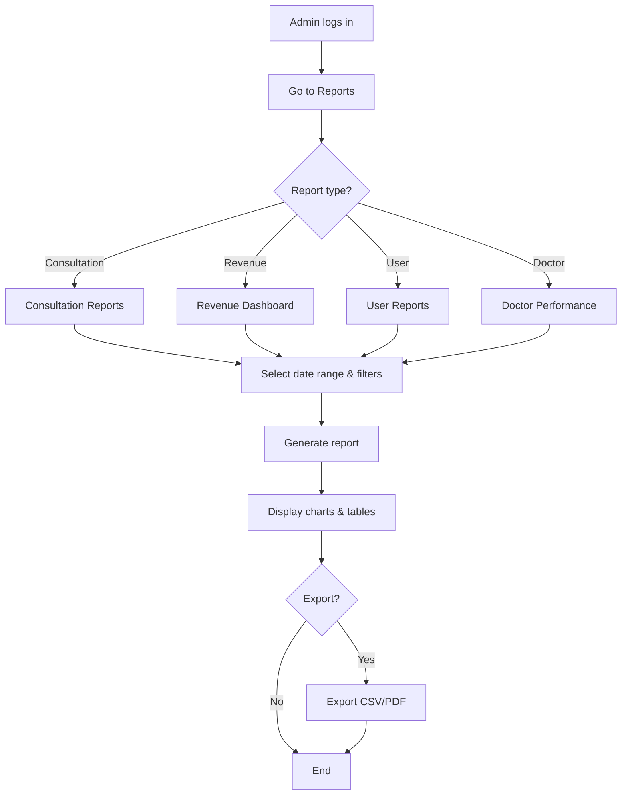

---

## 4. FEATURE LIST

> **MoSCoW Legend:** 🔴 Must | 🟡 Should | 🔵 Could | ⚫ Won't

### 4.1 Complete Feature List

#### 🔐 Authentication - User authentication and account management

| ID | Feature | Description | Platform | MoSCoW | Effort (h) | Phase | Note |
|----|---------|-------------|----------|--------|------------|-------|------|
| F001 | User Registration | Register account with email/phone | Web, iOS, Android | 🔴 Must | 40 | MVP | 3 platforms x validation + Privacy Act consent |
| F001a | Social Login - Google | Login with Google OAuth 2.0 | Web, iOS, Android | 🔴 Must | 24 | MVP | Google Sign-In SDK - Primary login method |
| F001b | Social Login - Facebook | Login with Facebook | Web, iOS, Android | 🔵 Could | 24 | 3 | Facebook Login SDK |
| F001c | Social Login - Apple | Login with Apple ID | iOS, Web | 🟡 Should | 16 | 2 | Required for iOS App Store |
| F003 | Profile Management | Manage personal information, Medicare | Web, iOS, Android | 🔴 Must | 32 | MVP | Medicare validation + APPs compliance |
| F003a | Password Reset | Forgot password reset via email | Web, iOS, Android | 🔴 Must | 12 | MVP | Email-based reset only |
| F003b | Session Management | Manage login sessions, remote logout | Web, iOS, Android | 🟡 Should | 16 | 2 | Security - view logged in devices |

**Subtotal Authentication:** 164 hours

---

#### 💊 Prescription - Online prescription services

| ID | Feature | Description | Platform | MoSCoW | Effort (h) | Phase | Note |
|----|---------|-------------|----------|--------|------------|-------|------|
| F004 | New Prescription Request | Request new medication prescription | Web, iOS, Android | 🔴 Must | 64 | MVP | Questionnaire + TGA compliance + 3 platforms |
| F004a | Medication Search | Search medications from internal database | Web, iOS, Android | 🔴 Must | 24 | MVP | Autocomplete from PBS/TGA database |
| F004b | Drug Interaction Check | Check drug interactions | Doctor Portal | 🟡 Should | 40 | 2 | MIMS/AMH database integration |
| F004c | Contraindication Alert | Alert for contraindications | Doctor Portal | 🟡 Should | 32 | 2 | Based on patient history |
| F005 | Repeat Prescription Request | Request prescription refill | Web, iOS, Android | 🔴 Must | 48 | MVP | History lookup + validation + 3 platforms |
| F005a | Refill Reminder | Reminder when medication running low | iOS, Android | 🔵 Could | 16 | 3 | Push notification based on prescription duration |
| F012 | eScript Generation | Create and send ePrescription (QR code) | Doctor Portal | 🔴 Must | 80 | MVP | eRx API integration + QR generation + TGA |
| F012a | Dosage Calculator | Calculate dosage by weight/age | Doctor Portal | 🟡 Should | 24 | 2 | Pediatric dosing support |
| F043 | Schedule 8 Medications | Controlled substances | - | ⚫ Won't | 0 | - | Not permitted under TGA regulations |

**Subtotal Prescription:** 328 hours

---

#### 📋 Certificate - Medical certificates

| ID | Feature | Description | Platform | MoSCoW | Effort (h) | Phase | Note |
|----|---------|-------------|----------|--------|------------|-------|------|
| F006 | Medical Certificate Request | Request medical certificate (Sick/School/Carer) | Web, iOS, Android | 🔴 Must | 48 | MVP | 3 cert types + AMA Guidelines + 3 platforms |
| F013 | Certificate Generation | Create and send Medical Certificate | Doctor Portal | 🔴 Must | 40 | MVP | PDF generation + AMA template + Fair Work Act |

**Subtotal Certificate:** 88 hours

---

#### 🩺 Consultation - Remote healthcare consultation

| ID | Feature | Description | Platform | MoSCoW | Effort (h) | Phase | Note |
|----|---------|-------------|----------|--------|------------|-------|------|
| F007 | Questionnaire System | Dynamic questionnaire by request type | Web, iOS, Android | 🔴 Must | 56 | MVP | Dynamic form builder + conditional logic |
| F007a | Symptom Checker | AI-assisted symptom triage before doctor | Web, iOS, Android | 🟡 Should | 80 | 2 | Helps classify urgency level |
| F009 | Virtual Waiting Room | Display queue position and wait time | Web, iOS, Android | 🔴 Must | 40 | MVP | Real-time queue + WebSocket |
| F009a | Queue Position Update | Real-time queue position updates | Web, iOS, Android | 🟡 Should | 16 | 2 | WebSocket push updates |
| F009b | Estimated Wait Time | Predict wait time based on queue | Web, iOS, Android | 🟡 Should | 24 | 2 | Algorithm based on avg consultation time |
| F010 | Video Consultation | Create Google Meet link for video call | Web, iOS, Android | 🟡 Should | 24 | 2 | Google Calendar API creates Meet link via email |
| F011 | Voice Consultation | Display doctor phone number for call | Web, iOS, Android | 🟡 Should | 8 | 2 | Click-to-call, no VoIP needed |
| F025 | In-app Chat | Chat with doctor during consultation | Web, iOS, Android | 🔴 Must | 64 | MVP | Real-time messaging + history - Core feature |
| F032 | Priority Queue | Priority processing with higher fee | Web, iOS, Android | 🟡 Should | 24 | 2 | Queue logic modification |
| F039 | Appointment Scheduling | Book appointments in advance | Web, iOS, Android | 🔵 Could | 56 | 3 | Calendar + availability management |

**Subtotal Consultation:** 392 hours

---

#### 📝 Referral - Specialist referrals

| ID | Feature | Description | Platform | MoSCoW | Effort (h) | Phase | Note |
|----|---------|-------------|----------|--------|------------|-------|------|
| F021 | Specialist Referral | Issue specialist referral letter | Web, iOS, Android | 🟡 Should | 48 | 2 | PDF generation + specialist list + 3 platforms |

**Subtotal Referral:** 48 hours

---

#### 🔬 Pathology - Test requests

| ID | Feature | Description | Platform | MoSCoW | Effort (h) | Phase | Note |
|----|---------|-------------|----------|--------|------------|-------|------|
| F022 | Pathology Request | Request pathology tests | Web, iOS, Android | 🟡 Should | 48 | 2 | Test catalog + PDF form + 3 platforms |

**Subtotal Pathology:** 48 hours

---

#### 💳 Payment - Payment processing

| ID | Feature | Description | Platform | MoSCoW | Effort (h) | Phase | Note |
|----|---------|-------------|----------|--------|------------|-------|------|
| F008 | Payment Processing | Payment via Credit Card, PayPal | Web, iOS, Android | 🔴 Must | 64 | MVP | Stripe/PayPal integration + PCI DSS |
| F008a | Apple Pay | Payment with Apple Pay | iOS, Web | 🟡 Should | 16 | 2 | Apple Pay SDK |
| F008b | Google Pay | Payment with Google Pay | Android, Web | 🟡 Should | 16 | 2 | Google Pay SDK |
| F008c | Afterpay/Zip | Buy Now Pay Later options | Web, iOS, Android | 🔵 Could | 24 | 3 | Third-party BNPL integration |
| F008d | Invoice Generation | Create PDF invoice for each transaction | Web, iOS, Android | 🔴 Must | 16 | MVP | Tax invoice for Medicare claims |
| F008e | Medicare Rebate Info | Display Medicare rebate information | Web, iOS, Android | 🔵 Could | 8 | 3 | Informational only |
| F031 | Subscription Plans | Monthly subscription packages | Web, iOS, Android | 🔴 Must | 48 | MVP | Recurring billing + plan management |
| F041 | Loyalty Program | Customer loyalty program | Web, iOS, Android | 🔵 Could | 40 | 3 | Points system + rewards |
| F047 | Insurance Claims Processing | Insurance processing | - | ⚫ Won't | 0 | - | Complex, requires multiple insurer integrations |

**Subtotal Payment:** 232 hours

---

#### 🔔 Notification - Notifications

| ID | Feature | Description | Platform | MoSCoW | Effort (h) | Phase | Note |
|----|---------|-------------|----------|--------|------------|-------|------|
| F017 | Email Notifications | Send email notifications (eScript, Certificate, Meet link) | System | 🔴 Must | 32 | MVP | SendGrid/SES + templates |
| F018 | Push Notifications | Push notifications on mobile | iOS, Android | 🔴 Must | 32 | MVP | FCM/APNs integration |

**Subtotal Notification:** 64 hours

---

#### ✅ Verification - Verification services

| ID | Feature | Description | Platform | MoSCoW | Effort (h) | Phase | Note |
|----|---------|-------------|----------|--------|------------|-------|------|
| F019 | Certificate Verification | Portal for employer certificate verification | Web | 🔴 Must | 24 | MVP | Public portal + Privacy Act (limited info) |

**Subtotal Verification:** 24 hours

---

#### 👨‍⚕️ Doctor Portal - Doctor information portal

| ID | Feature | Description | Platform | MoSCoW | Effort (h) | Phase | Note |
|----|---------|-------------|----------|--------|------------|-------|------|
| F014 | Doctor Request Queue | List of pending requests | Doctor Portal | 🔴 Must | 40 | MVP | List view with filters |
| F014a | Request Filtering | Filter requests by type, priority, status | Doctor Portal | 🔴 Must | 16 | MVP | Filter by type, urgency |
| F014b | Request Assignment | Auto/manual assign requests to doctors | Doctor Portal | 🔴 Must | 24 | MVP | Load balancing algorithm |
| F015 | Patient History View | View patient consultation history | Doctor Portal | 🟡 Should | 32 | MVP | Medical records access |
| F015a | Clinical Notes Template | Clinical notes template by consultation type | Doctor Portal | 🔴 Must | 32 | MVP | SOAP notes format |
| F015b | ICD-10 Coding | Diagnosis coding per ICD-10 | Doctor Portal | 🟡 Should | 24 | 2 | Autocomplete ICD-10 codes |
| F026 | Doctor Availability | Display doctor online/offline status | Doctor Portal | 🟡 Should | 24 | 2 | Status management + scheduling |
| F042 | Doctor Mobile App | Mobile app for doctors | iOS, Android | 🔵 Could | 160 | 3 | Full mobile app development |

**Subtotal Doctor Portal:** 352 hours

---

#### ⚙️ Admin - System administration

| ID | Feature | Description | Platform | MoSCoW | Effort (h) | Phase | Note |
|----|---------|-------------|----------|--------|------------|-------|------|
| F020 | Admin User Management | Manage user accounts | Admin Portal | 🔴 Must | 40 | MVP | CRUD + roles + Privacy Act |
| F020a | Role-Based Access Control | Permission by role (System/Doctor/Finance/Support Admin) | Admin Portal | 🔴 Must | 40 | MVP | Granular permissions |
| F020b | Audit Log | Log all admin actions | Admin Portal | 🔴 Must | 32 | MVP | Compliance requirement |
| F020c | System Health Dashboard | Real-time system monitoring | Admin Portal | 🟡 Should | 24 | 2 | Uptime, errors, performance |
| F027 | Admin Reports | Statistical reports | Admin Portal | 🟡 Should | 48 | 2 | Charts + export + multiple report types |
| F028 | Doctor Verification | Review AHPRA registration | Admin Portal | 🔴 Must | 32 | MVP | AHPRA API/manual check + workflow |
| F028a | AHPRA API Integration | Auto verify AHPRA registration | Admin Portal | 🟡 Should | 40 | 2 | Real-time AHPRA lookup |
| F028b | Credential Expiry Alert | Alert for expiring registration/insurance | Admin Portal | 🔴 Must | 16 | MVP | Auto-notify before expiry |
| F028c | Doctor Performance Metrics | Doctor KPIs (response time, rating, volume) | Admin Portal | 🔵 Could | 32 | 3 | Performance dashboard |
| F029 | Refund Processing | Process refunds | Admin Portal | 🟡 Should | 24 | 2 | Payment gateway refund API |
| F029a | Transaction History | Detailed transaction history | Admin Portal | 🔴 Must | 24 | MVP | Search, filter, export |
| F029b | Revenue Dashboard | Real-time revenue dashboard | Admin Portal | 🟡 Should | 32 | 2 | Charts, trends, forecasts |
| F029c | Doctor Payout Management | Manage doctor payments | Admin Portal | 🔴 Must | 40 | MVP | Calculate and process payouts |

**Subtotal Admin:** 424 hours

---

#### 🎫 Support - Customer support

| ID | Feature | Description | Platform | MoSCoW | Effort (h) | Phase | Note |
|----|---------|-------------|----------|--------|------------|-------|------|
| F048 | Support Ticket System | Customer support ticket system | Admin Portal | 🟡 Should | 48 | 2 | Create, assign, track tickets |
| F048a | Ticket Escalation | Escalate tickets to higher level | Admin Portal | 🟡 Should | 16 | 2 | Escalation workflow |
| F048b | Canned Responses | Quick reply templates for common issues | Admin Portal | 🟡 Should | 16 | 2 | Template management |
| F048c | Live Chat Support | Live chat with users from Admin Portal | Admin Portal | 🔵 Could | 40 | 3 | Real-time support |

**Subtotal Support:** 120 hours

---

#### 📜 History - History records

| ID | Feature | Description | Platform | MoSCoW | Effort (h) | Phase | Note |
|----|---------|-------------|----------|--------|------------|-------|------|
| F023 | Consultation History | View consultation history | Web, iOS, Android | 🔴 Must | 32 | MVP | Medical records + 7 year retention |
| F024 | Prescription History | View prescription history | Web, iOS, Android | 🔴 Must | 32 | MVP | eScript history + refill tracking |

**Subtotal History:** 64 hours

---

#### 🏥 Specialty Service - Specialized services

| ID | Feature | Description | Platform | MoSCoW | Effort (h) | Phase | Note |
|----|---------|-------------|----------|--------|------------|-------|------|
| F033 | Weight Loss Program | Weight loss program with follow-up | Web, iOS, Android | 🔵 Could | 80 | 3 | TGA approved medications + follow-up |
| F034 | Psychology Services | Mental Health psychology services | Web, iOS, Android | 🔵 Could | 80 | 3 | AHPRA Psychologists + Mental Health Plan |
| F035 | Health Check Packages | Health check packages (Basic, Comprehensive, Men's, Women's) | Web, iOS, Android | 🔵 Could | 64 | 3 | Package builder + pathology integration |
| F046 | Surgery Booking | Surgery booking | - | ⚫ Won't | 0 | - | Outside telehealth scope |

**Subtotal Specialty Service:** 224 hours

---

#### 🔗 Integration - External system integration

| ID | Feature | Description | Platform | MoSCoW | Effort (h) | Phase | Note |
|----|---------|-------------|----------|--------|------------|-------|------|
| F036 | Pharmacy Delivery Integration | Medication delivery integration | Web, iOS, Android | 🔵 Could | 80 | 3 | Third-party pharmacy API |
| F037 | My Health Record Integration | National health system integration | System | 🔵 Could | 120 | 3 | Digital Health Agency API + certification |
| F038 | PBS Integration | Pharmaceutical Benefits Scheme integration | System | 🔵 Could | 80 | 3 | PBS API + eligibility check |

**Subtotal Integration:** 280 hours

---

#### 💊 Medication Database - Medication database

| ID | Feature | Description | Platform | MoSCoW | Effort (h) | Phase | Note |
|----|---------|-------------|----------|--------|------------|-------|------|
| F049 | Medication Database Sync | Sync PBS/TGA data weekly to internal DB | System | 🔴 Must | 40 | MVP | ETL job scheduled weekly |
| F049a | Medication Search API | Full-text medication search (generic, brand name) | System | 🟡 Should | 24 | 2 | Autocomplete, fuzzy search |
| F049b | Drug Interaction Database | Store drug interaction information | System | 🟡 Should | 32 | 2 | MIMS/AMH data integration |
| F049c | Sync Monitoring Dashboard | Dashboard to monitor sync status, data freshness | Admin Portal | 🟡 Should | 16 | 2 | Alert when sync fails |

**Subtotal Medication Database:** 112 hours

---

#### 🌐 System - System features

| ID | Feature | Description | Platform | MoSCoW | Effort (h) | Phase | Note |
|----|---------|-------------|----------|--------|------------|-------|------|
| F030 | Multi-language Support | Multi-language support | Web, iOS, Android | 🟡 Should | 40 | 2 | i18n framework + translation |

**Subtotal System:** 40 hours

---

### 4.2 Summary by MoSCoW and Effort

| MoSCoW | Icon | Count | Total Effort (h) | Note |
|--------|------|-------|------------------|------|
| **Must Have** | 🔴 | 27 | 1,228 | Core features for MVP |
| **Should Have** | 🟡 | 31 | 968 | Enhanced UX, Phase 2 |
| **Could Have** | 🔵 | 16 | 1,000 | Nice-to-have, Phase 3 |
| **Won't Have** | ⚫ | 3 | 0 | Out of scope |
| **TOTAL** | | **77** | **3,196** | |

#### Effort by Phase

| Phase | Effort (h) | Man-days | Description |
|-------|------------|----------|-------------|
| **Phase 1 (MVP)** | 1,228 | 154 | Must Have features |
| **Phase 2** | 872 | 121 | Should Have features |
| **Phase 3** | 904 | 125 | Could Have features |
| **TOTAL** | **3,004** | **376** | |

> *Assumption: 1 man-day = 8 hours*

---

### 4.3 Summary by Feature Group

| Icon | Feature Group | Description | Count | Effort (h) | MoSCoW |
|------|---------------|-------------|-------|------------|--------|
| 🔐 | **Authentication** | Authentication, Social Login | 7 | 164 | 4🔴 2🟡 1🔵 |
| 💊 | **Prescription** | Prescriptions, Drug Interaction | 9 | 328 | 4🔴 4🟡 1⚫ |
| 📋 | **Certificate** | Medical certificates | 2 | 88 | 2🔴 |
| 🩺 | **Consultation** | Chat, Video/Voice (Google Meet) | 10 | 392 | 3🔴 6🟡 1🔵 |
| 📝 | **Referral** | Specialist referrals | 1 | 48 | 1🟡 |
| 🔬 | **Pathology** | Test requests | 1 | 48 | 1🟡 |
| 💳 | **Payment** | Payment, Subscription | 9 | 232 | 3🔴 2🟡 3🔵 1⚫ |
| 🔔 | **Notification** | Email, Push | 2 | 64 | 2🔴 |
| ✅ | **Verification** | Certificate verification | 1 | 24 | 1🔴 |
| 👨‍⚕️ | **Doctor Portal** | Queue, Clinical Notes | 8 | 352 | 4🔴 3🟡 1🔵 |
| ⚙️ | **Admin** | Administration, RBAC, Audit | 13 | 424 | 7🔴 5🟡 1🔵 |
| 🎫 | **Support** | Ticket system | 4 | 120 | 3🟡 1🔵 |
| 📜 | **History** | Consultation, prescription history | 2 | 64 | 2🔴 |
| 🏥 | **Specialty Service** | Weight Loss, Psychology | 4 | 224 | 3🔵 1⚫ |
| 🔗 | **Integration** | eRx, PBS, My Health Record | 3 | 280 | 3🔵 |
| 💊 | **Medication Database** | Sync PBS/TGA | 4 | 112 | 1🔴 3🟡 |
| 🌐 | **System** | Multi-language | 1 | 40 | 1🟡 |

---

### 4.4 Features by Actor

| Actor | Role | Key Features | Count |
|-------|------|--------------|-------|
| **Patient** | Patient using services | Registration, Social Login, Consultation, Payment, History | 25 |
| **Doctor** | AHPRA doctor performing consultations | Request Queue, Patient Review, Prescribing, Certificate | 12 |
| **Admin - System** | System administration | User Management, RBAC, Audit Log | 4 |
| **Admin - Doctor** | Doctor management | Doctor Verification, AHPRA Check, Performance | 4 |
| **Admin - Finance** | Financial management | Transaction History, Revenue Dashboard, Payout | 4 |
| **Admin - Support** | Customer support | Ticket System, Escalation | 4 |
| **Employer** | Certificate verification | Certificate Verification | 1 |
| **System** | Background jobs | Medication Sync, Notifications | 5 |

---

## 5. SCOPE

### 5.1 In-Scope (MVP - Phase 1)

#### Patient App/Web
| Module | Features | Description |
|--------|----------|-------------|
| **Authentication** | F001, F001a, F003, F003a | Registration, Google Login, Profile, Password Reset |
| **Prescription** | F004, F004a, F005 | New/Repeat Prescription Request, Medication Search |
| **Certificate** | F006 | Medical Certificate Request |
| **Consultation** | F007, F009, F025 | Questionnaire, Virtual Waiting Room, In-app Chat |
| **Payment** | F008, F008d, F031 | Payment Processing, Invoice, Subscription |
| **History** | F023, F024 | Consultation & Prescription History |
| **Notification** | F017, F018 | Email & Push Notifications |

#### Doctor Portal
| Module | Features | Description |
|--------|----------|-------------|
| **Queue Management** | F014, F014a, F014b | Request Queue, Filtering, Assignment |
| **Patient Review** | F015a | Clinical Notes Template |
| **Prescribing** | F012 | eScript Generation |
| **Certificate** | F013 | Certificate Generation |

#### Admin Portal
| Module | Features | Description |
|--------|----------|-------------|
| **User Management** | F020, F020a, F020b | User CRUD, RBAC, Audit Log |
| **Doctor Management** | F028, F028b | Doctor Verification, Credential Expiry Alert |
| **Finance** | F029a, F029c | Transaction History, Doctor Payout |
| **Medication** | F049 | Medication Database Sync |

#### Verification Portal
| Module | Features | Description |
|--------|----------|-------------|
| **Certificate Verification** | F019 | Public portal for employers |

---

### 5.2 Phase 2 (Should Have)

| Module | Features | Description |
|--------|----------|-------------|
| **Authentication** | F001c, F003b | Apple Login, Session Management |
| **Prescription** | F004b, F004c, F005a, F012a | Drug Interaction, Contraindication, Refill Reminder, Dosage Calculator |
| **Consultation** | F007a, F009a, F009b, F010, F011, F032 | Symptom Checker, Queue Updates, Video/Voice (Google Meet), Priority Queue |
| **Referral/Pathology** | F021, F022 | Specialist Referral, Pathology Request |
| **Payment** | F008a, F008b | Apple Pay, Google Pay |
| **Doctor Portal** | F015, F015b, F026 | Patient History View, ICD-10 Coding, Doctor Availability |
| **Admin** | F020c, F027, F028a, F028c, F029, F029b | System Health, Reports, AHPRA API, Performance Metrics, Refund, Revenue Dashboard |
| **Support** | F048, F048a, F048b | Ticket System, Escalation, Canned Responses |
| **Medication** | F049a, F049b, F049c | Search API, Drug Interaction DB, Sync Monitoring |
| **System** | F030 | Multi-language Support |

---

### 5.3 Phase 3 (Could Have)

| Module | Features | Description |
|--------|----------|-------------|
| **Authentication** | F001b | Facebook Login |
| **Prescription** | F005a | Refill Reminder |
| **Consultation** | F039 | Appointment Scheduling |
| **Payment** | F008c, F008e, F041 | Afterpay/Zip, Medicare Rebate Info, Loyalty Program |
| **Doctor Portal** | F042 | Doctor Mobile App |
| **Admin** | F028c | Doctor Performance Metrics |
| **Support** | F048c | Live Chat Support |
| **Specialty Service** | F033, F034, F035 | Weight Loss, Psychology, Health Check Packages |
| **Integration** | F036, F037, F038 | Pharmacy Delivery, My Health Record, PBS Integration |

---

### 5.4 Out of Scope (Won't Have)

| Feature | Reason |
|---------|--------|
| F043 - Schedule 8 Medications | Not permitted under TGA regulations |
| F046 - Surgery Booking | Outside telehealth scope |
| F047 - Insurance Claims | Complex, requires multiple insurer integrations |

---

### 5.5 Platform Scope

| Platform | MVP | Phase 2 | Phase 3 |
|----------|:---:|:-------:|:-------:|
| **Web (Patient)** | ✅ | ✅ | ✅ |
| **iOS App** | ✅ | ✅ | ✅ |
| **Android App** | ✅ | ✅ | ✅ |
| **Web (Doctor Portal)** | ✅ | ✅ | ✅ |
| **Web (Admin Portal)** | ✅ | ✅ | ✅ |
| **Web (Verification Portal)** | ✅ | ✅ | ✅ |
| **Doctor Mobile App** | ❌ | ❌ | ✅ |

---

### 5.6 Service Scope by Phase

| Service | MVP | Phase 2 | Phase 3 |
|---------|:---:|:-------:|:-------:|
| **Online Prescription (New)** | ✅ | ✅ | ✅ |
| **Online Prescription (Repeat)** | ✅ | ✅ | ✅ |
| **Medical Certificate** | ✅ | ✅ | ✅ |
| **In-app Chat Consultation** | ✅ | ✅ | ✅ |
| **Video/Voice (Google Meet)** | ❌ | ✅ | ✅ |
| **Specialist Referral** | ❌ | ✅ | ✅ |
| **Pathology Request** | ❌ | ✅ | ✅ |
| **Weight Loss Program** | ❌ | ❌ | ✅ |
| **Psychology Services** | ❌ | ❌ | ✅ |
| **Health Check Packages** | ❌ | ❌ | ✅ |

---

## 6. ASSUMPTIONS

### 6.1 Business Assumptions

| ID | Assumption | Risk if Wrong | Mitigation |
|----|------------|---------------|------------|
| **A01** | Australian users willing to pay for telehealth | Low revenue | Competitive pricing |
| **A02** | Sufficient AHPRA doctors register as partners | Insufficient capacity | Recruitment before launch |
| **A03** | Employers accept online medical certificates | Users won't use service | Comply with AMA Guidelines, Fair Work Act |
| **A04** | Australian telehealth market continues to grow | Low ROI | Competitors have 1M+ users |

### 6.2 Technical Assumptions

| ID | Assumption | Risk if Wrong | Mitigation |
|----|------------|---------------|------------|
| **A05** | eRx API available and stable | Cannot send eScript | Backup: PDF prescription |
| **A06** | Email gateway operates 99.9% | Cannot send notifications | Multi-provider fallback |
| **A07** | Video call quality sufficient on 4G | Poor UX | Voice call fallback |
| **A08** | Payment gateway supports AUD | Cannot process payments | Stripe/PayPal both support |

### 6.3 User Assumptions

| ID | Assumption | Risk if Wrong | Mitigation |
|----|------------|---------------|------------|
| **A09** | Users have smartphone with camera | Cannot video call | Voice call option |
| **A10** | Users have stable internet | Consultation interrupted | Voice call fallback |
| **A11** | Users know basic app usage | Need more support | Simple UX, FAQ |
| **A12** | Users have Medicare card or private insurance | Complicated flow | Optional field |

---

## 7. CONSTRAINTS

### 7.1 Regulatory Constraints

| ID | Constraint | Impact | Regulation/Source |
|----|------------|--------|-------------------|
| **C01** | Doctors must have AHPRA registration | Need verification process | [AHPRA - Health Practitioner Regulation National Law](https://www.ahpra.gov.au/About-Ahpra/What-We-Do/Legislation.aspx) |
| **C02** | Cannot prescribe Schedule 8 medications | Limited medication types | [TGA - Poisons Standard (SUSMP)](https://www.tga.gov.au/how-we-regulate/ingredients-and-scheduling-medicines-and-chemicals/poisons-standard-and-scheduling-medicines-and-chemicals) |
| **C03** | Comply with Privacy Act 1988 | Need encryption, consent | [Privacy Act 1988 (Cth)](https://www.legislation.gov.au/C2004A03712/latest/text) |
| **C04** | Medical certificate must follow AMA Guidelines | Fixed template | [AMA Guidelines for Medical Certificates](https://www.ama.com.au/articles/guidelines-medical-practitioners-certificates-certifying-illness) |
| **C05** | ePrescription must follow eRx standard | Mandatory integration | [Australian Digital Health Agency - Electronic Prescriptions](https://www.digitalhealth.gov.au/initiatives-and-programs/electronic-prescriptions) |
| **C06** | Store medical records for 7 years | Storage requirements | [RACGP - Medical Records Retention](https://www.racgp.org.au/running-a-practice/practice-standards/standards-for-general-practices-5th-edition/standards-for-general-practices-5th-edition/core-standard-4-practice-management/criterion-c4-2-health-records) |
| **C07** | Comply with TGA regulations | Prescription medications regulated | [TGA - Prescribing Medicines](https://www.tga.gov.au/how-we-regulate/prescribing-and-dispensing-medicines) |
| **C08** | Fair Work Act 2009 | Medical certificate accepted | [Fair Work Act 2009 - Sick Leave](https://www.legislation.gov.au/C2009A00028/latest/text) |
| **C09** | Australian Privacy Principles (APPs) | Personal information handling | [OAIC - Australian Privacy Principles](https://www.oaic.gov.au/privacy/australian-privacy-principles) |
| **C10** | Notifiable Data Breaches scheme | Report data breaches | [OAIC - Notifiable Data Breaches](https://www.oaic.gov.au/privacy/notifiable-data-breaches) |
| **C11** | My Health Records Act 2012 | National health system integration (optional) | [My Health Records Act 2012](https://www.legislation.gov.au/C2012A00063/latest/text) |
| **C12** | Therapeutic Goods Act 1989 | Medication and medical device management | [Therapeutic Goods Act 1989](https://www.legislation.gov.au/C2004A03952/latest/text) |

### 7.2 Technical Constraints

| ID | Constraint | Impact | Mitigation |
|----|------------|--------|------------|
| **T01** | Must support iOS 14+ and Android 10+ | Limited older device support | Clear minimum requirements |
| **T02** | Must support major browsers (Chrome, Safari, Firefox, Edge) | Cross-browser testing | Responsive design + testing |
| **T03** | Data must be stored in Australian data centers | AWS Sydney region | Use ap-southeast-2 region |
| **T04** | Must achieve 99.9% uptime SLA | High availability architecture | Multi-AZ deployment |
| **T05** | Page load time < 3 seconds | Performance optimization | CDN, caching, optimization |

### 7.3 Business Constraints

| ID | Constraint | Impact | Mitigation |
|----|------------|--------|------------|
| **B01** | MVP launch within 6 months | Limited feature set | Prioritize Must-Have features |
| **B02** | Budget constraint for Phase 1 | Resource limitations | Efficient development practices |
| **B03** | Must be competitive with existing players | Pricing pressure | Value-added features |

---

## APPENDIX

### A. Glossary

| Term | Definition |
|------|------------|
| **AHPRA** | Australian Health Practitioner Regulation Agency - regulates health practitioners |
| **eScript** | Electronic prescription with QR code for pharmacy dispensing |
| **PBS** | Pharmaceutical Benefits Scheme - Australian government medication subsidy program |
| **TGA** | Therapeutic Goods Administration - regulates medicines and medical devices |
| **Medicare** | Australia's universal health insurance scheme |
| **GP** | General Practitioner - primary care doctor |
| **SOAP Notes** | Subjective, Objective, Assessment, Plan - clinical documentation format |
| **ICD-10** | International Classification of Diseases, 10th revision |
| **APPs** | Australian Privacy Principles |

---

*Document prepared for TeleHealth Australia project*